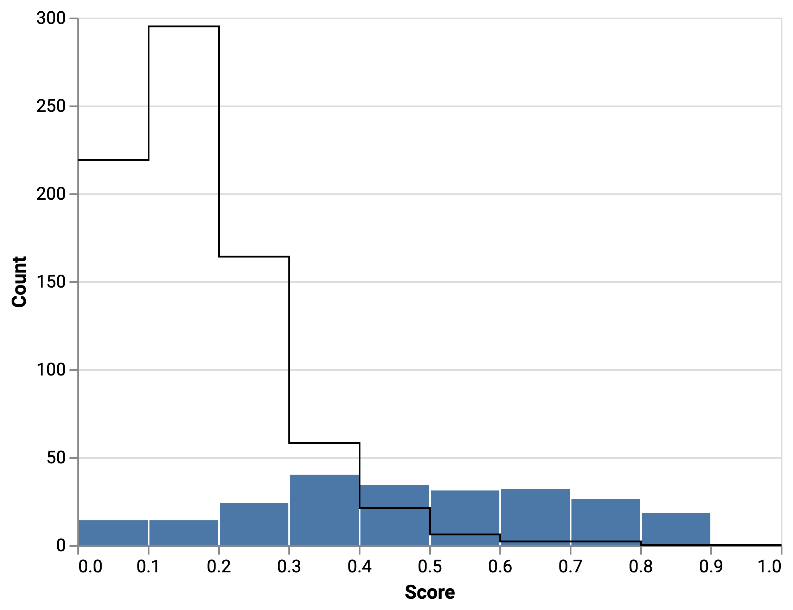

# Score Distribution Chart

## References

- [metriculous](https://github.com/metriculous-ml/metriculous) package.
- [How to bin data before sending it to a chart?](https://github.com/altair-viz/altair/issues/1691) issue.
