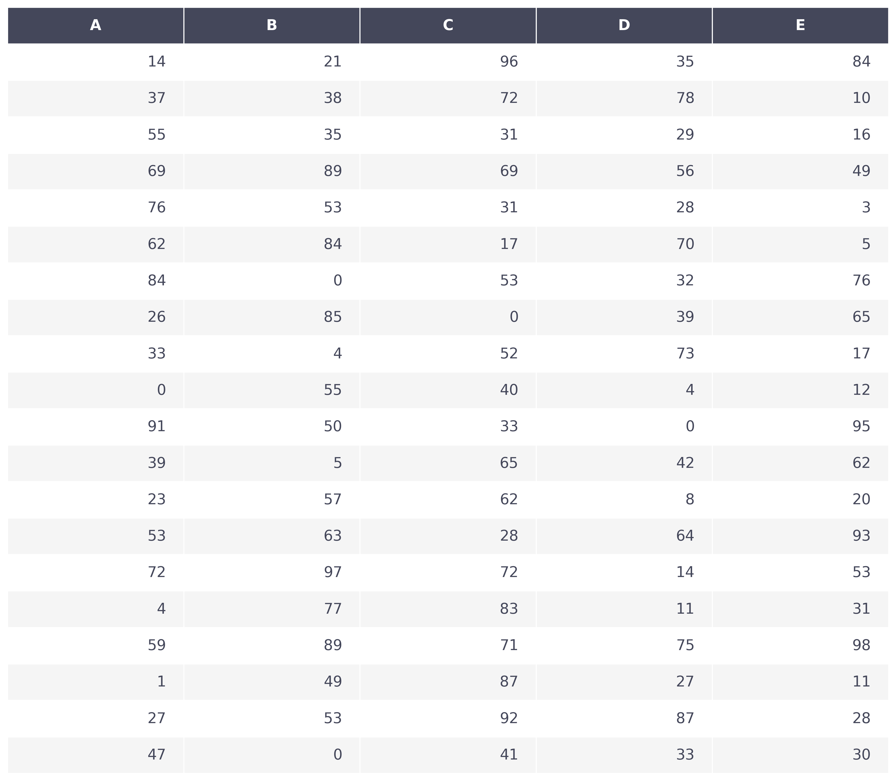

# pandas-matplotlib-table

Generate an image of a [pandas](https://pandas.pydata.org/) DataFrame (table) using [Matplotlib](https://matplotlib.org/).

## Quickstart

- `pipenv install --python 3.8`.
- `pipenv shell`.
- `python script.py`.

## Example

## References

- [volodymyr's reply on Stack Overflow](https://stackoverflow.com/a/39358722).
